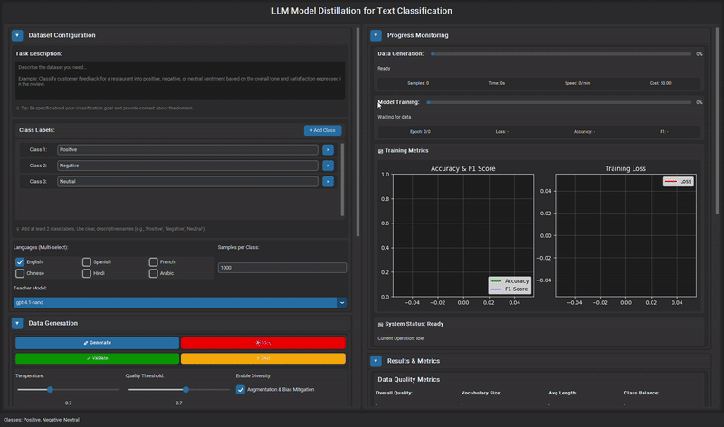

# LLM Model Distillation for Text Classification

## Demo



## Overview

A production-grade, standalone GUI application for LLM knowledge distillation that creates synthetic, class-balanced datasets using OpenAI models and distills this knowledge into small Hugging Face models for multi-class text classification. The application features real-time progress monitoring, comprehensive quality metrics, and an intuitive collapsible interface optimized for productivity.

## Key Features

### OpenAI Teacher Models
- Latest 2025 models: GPT-4.1-nano (default), GPT-4.1-mini, GPT-4.1, GPT-4o, GPT-4o-mini, o1-mini, o3-mini, o3-pro
- Configurable generation parameters (temperature, top-p)
- Real-time cost tracking and token usage monitoring
- Secure API key management via environment variables

### Hugging Face Student Models
- Pre-configured efficient models: DistilBERT, TinyBERT, ALBERT, BERT-mini
- Custom model support via Hugging Face URLs with compatibility validation
- Automatic model download and local storage
- Advanced knowledge distillation with temperature scaling and alpha blending

### Multi-Language Dataset Generation
- Checkbox-based multi-language selection: English, Spanish, French, Chinese, Hindi, Arabic
- Simultaneous generation across multiple languages for diverse datasets
- Language-specific quality metrics and validation
- Automatic language tagging in generated samples

### Interactive GUI Interface
- Full-screen windowed launch for maximum workspace
- Collapsible sections: Dataset Configuration, Data Generation, Model Training, Progress Monitoring, Results & Metrics
- Real-time progress updates with detailed statistics
- Live quality metrics visualization with charts and graphs
- Responsive two-column layout optimized for productivity

### Advanced Data Quality
- Comprehensive quality metrics: vocabulary size, lexical diversity, class balance, duplicate detection
- Bias detection and PII filtering for safety compliance
- N-gram diversity analysis (distinct-1, distinct-2, distinct-3)
- Safety status monitoring and validation

### Training & Evaluation
- Custom epoch configuration with dynamic early stopping
- Real-time training metrics with live chart updates
- Comprehensive evaluation: accuracy, F1-macro, precision, recall
- Support for partial datasets from early-stopped generation
- Model export in multiple formats

## Installation

### Prerequisites
- Python 3.8 or higher
- 8GB+ RAM recommended
- 10GB+ free disk space
- OpenAI API key

### Setup Instructions

1. **Clone the repository**
```bash
git clone https://github.com/mominalix/LLM-Model-Distillation-for-Text-Classification-Models-GUI.git
cd LLM-Model-Distillation-for-Text-Classification-Models-GUI

```

2. **Create and activate virtual environment**
```bash
# Windows
python -m venv venv
venv\Scripts\activate

# macOS/Linux
python -m venv venv
source venv/bin/activate
```

3. **Install dependencies**
```bash
pip install -r requirements.txt
```

4. **Install the package in development mode**
```bash
pip install -e .
```

5. **Configure environment variables**
```bash
# Copy the example environment file
cp example-env .env

# Edit .env file with your OpenAI API key
# OPENAI_API_KEY=your_actual_api_key_here
```

6. **Launch the application**
```bash
python main.py
```

## Usage Guide

### Getting Started

1. **Launch Application**: Run `python main.py` - the application opens in full-screen windowed mode
2. **Configure Dataset**: In the "Dataset Configuration" section:
   - Enter your task description (e.g., "Classify customer reviews as positive, negative, or neutral")
   - Add class labels using the class management panel
   - Select multiple languages using checkboxes
   - Set samples per class and choose teacher model

3. **Generate Data**: In the "Data Generation" section:
   - Click "Generate" to start synthetic data creation
   - Monitor real-time progress with cost tracking
   - Stop early if needed - partial datasets are fully usable
   - View quality metrics in "Results & Metrics" section

4. **Train Model**: In the "Model Training" section:
   - Select a pre-configured student model or enter custom Hugging Face URL
   - Configure training parameters (epochs, batch size, learning rate)
   - Use generated dataset or browse for existing dataset folder
   - Monitor real-time training progress with live charts

### Interface Sections

**Dataset Configuration**
- Task description input with natural language specification
- Dynamic class label management (add/remove labels)
- Multi-language checkbox selection
- Samples per class configuration
- Teacher model selection dropdown

**Data Generation**  
- Generate, Stop, Validate, and Cost estimation buttons
- Real-time progress with sample counts and cost tracking
- Current class and batch progress indicators
- Quality validation and safety checks

**Model Training**
- Student model selection with custom URL support
- Training parameter configuration
- Dataset source selection (generated or browse folder)
- Real-time training metrics and progress

**Progress Monitoring**
- Live generation progress with detailed statistics
- Training progress with epoch-by-epoch metrics
- Real-time cost tracking and sample counts
- Interactive charts and visualizations

**Results & Metrics**
- Data quality metrics: overall quality, vocabulary size, class balance
- Diversity metrics: lexical diversity, distinct-n-grams
- Safety metrics: PII detection, bias scores
- Training metrics: accuracy, F1-score, precision, recall
- Interactive visualizations and performance charts

### Advanced Features

**Multi-Language Generation**
- Select multiple languages simultaneously for diverse datasets
- Each language generates the specified number of samples per class
- Language metadata automatically added to samples
- Combined quality metrics across all languages

**Custom Model Integration**
- Enter any Hugging Face model URL for student training
- Automatic compatibility validation before training
- Support for different model architectures (BERT, DistilBERT, RoBERTa, etc.)
- Intelligent parameter handling for different model types

**Quality Assurance**
- Real-time quality scoring during generation
- Duplicate detection and removal
- Bias detection and mitigation
- PII filtering for privacy compliance
- Safety status monitoring

**Flexible Training**
- Use generated datasets or load existing ones
- Support for partial datasets from early-stopped generation
- Dynamic early stopping based on user-defined epochs
- Mixed precision training for efficiency
- Real-time metric visualization

## File Structure

```
LLM Model Distillation for Text Classification/
├── main.py                                 # Application entry point
├── requirements.txt                        # Dependencies
├── example-env                            # Environment template
├── README.md                             # Documentation
├── src/llm_distillation/                 # Main package
│   ├── __init__.py
│   ├── config.py                         # Configuration management
│   ├── exceptions.py                     # Custom exceptions
│   ├── data/                            # Data processing
│   │   ├── generator.py                 # Synthetic data generation
│   │   ├── processor.py                 # Data preprocessing
│   │   ├── validation.py                # Quality validation
│   │   └── augmentation.py              # Data augmentation
│   ├── llm/                            # LLM integration
│   │   ├── base.py                      # Base LLM interface
│   │   ├── openai_client.py             # OpenAI API client
│   │   └── model_manager.py             # Model management
│   ├── training/                        # Model training
│   │   ├── trainer.py                   # Training orchestrator
│   │   ├── distillation.py              # Knowledge distillation
│   │   └── evaluation.py                # Model evaluation
│   ├── security/                        # Security features
│   │   └── api_key_manager.py           # API key security
│   └── gui/                            # User interface
│       ├── main_window.py               # Main application window
│       └── components/                  # UI components
│           ├── task_input.py            # Task description input
│           ├── class_management.py      # Class label management
│           ├── generation_controls.py   # Generation controls
│           ├── training_controls.py     # Training controls
│           ├── progress_panel.py        # Progress monitoring
│           ├── metrics_panel.py         # Quality metrics display
│           ├── collapsible_frame.py     # Collapsible UI sections
│           └── utils.py                 # UI utilities
├── datasets/                            # Generated datasets
├── models/                             # Trained models
├── cache/                              # Model cache
├── logs/                               # Application logs
└── output/                             # Training outputs
```

## Configuration

The application uses environment variables for configuration. Copy `example-env` to `.env` and modify:

**Required Settings:**
- `OPENAI_API_KEY`: Your OpenAI API key

**Optional Settings:**
- `DEFAULT_TEACHER_MODEL`: Default OpenAI model (default: gpt-4.1-nano)
- `DEFAULT_STUDENT_MODEL`: Default student model (default: distilbert-base-uncased)
- `DEFAULT_SAMPLES_PER_CLASS`: Default samples per class (default: 1000)
- `BATCH_SIZE`: Training batch size (default: 32)
- `LEARNING_RATE`: Training learning rate (default: 2e-5)
- `NUM_EPOCHS`: Default training epochs (default: 3)


## Development

### Running Tests
```bash
# Install test dependencies (included in requirements.txt)
pytest tests/
```

### Code Quality
```bash
# Format code
black src/

# Sort imports
isort src/

# Lint code
flake8 src/
```

### Adding New Features

1. **New Teacher Models**: Add to `OpenAIModel` enum in `config.py`
2. **New Student Models**: Add to `HuggingFaceModel` enum in `config.py`
3. **New Languages**: Add to `Language` enum in `config.py`
4. **New UI Components**: Create in `src/llm_distillation/gui/components/`

